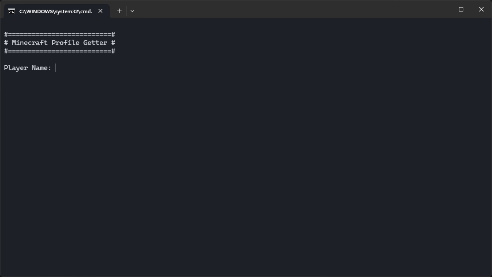

# MinecraftProfileGetter

MinecraftProfileGetter is a Tool to request Minecraft profiles.

## Features

MinecraftProfileGetter has the following features:
- Request the players UUID
- Request the players Skin texture
- Output as JSON-Object
- Output as plain text

## Installation

MinecraftProfileGetter doesn't needs to be installed. Just unpack the ZIP folder.

## How to use

There are a few different modes to get the data:

### Help

Get the help page for this program

1. Start the file `start_help.bat`

### Normal

Get the player data as plain text

1. Start the file `start.bat`
2. Enter the player name
3. Press Enter to restart or enter "exit" and press Enter to exit the program.

### RAW

Get the player as JSON-Object

1. Start the file `start_raw.bat`
2. Enter the player name
3. Press Enter to restart or enter "exit" and press Enter to exit the program.

### Clear on exit

Analogous to Normal mode, but with the addtion that it clears the terminal on program exit.

1. Start the file `start_clear.bat`
2. Enter the player name
3. Press [Enter] to restart or enter "exit" and press [Enter] to exit the program and clear the terminal.

### Terminal

Or just type the command manually in the Terminal! \
`java -jar MinecraftProfileGetter.jar`

Run the following command for a help page! \
`java -jar MinecraftProfileGetter.jar -h`

## Deinstallation

Delete the folder.

## Credits

Thanks to
- **[stleary](https://github.com/stleary):** [org.json](https://github.com/stleary/JSON-java)
  

