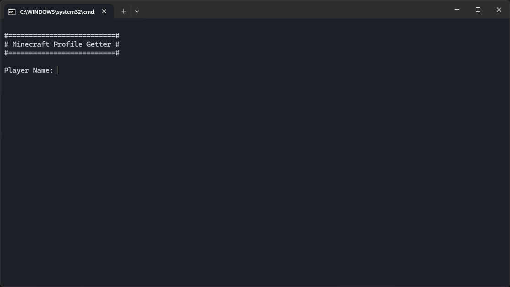

# MinecraftProfileGetter

MinecraftProfileGetter ist ein Tool zum Abrufen von Minecraft Profilen.

## Features

MinecraftProfileGetter bietet folgende Features:
- Abfragen der UUID des Spielers
- Abfragen der Skintextur des Spielers
- Rückgabe als JSON-Objekt
- Rückgabe als Klartext

## Installation

Installation wird nicht benötigt. Einfach den ZIP-Ordner entpacken.

## How to use

Es gibt mehrere verschiedene Modi, mit denen die Daten abgerufen werden können. 

### Hilfe

Zeigt die Hilfeseite an.

1. Starte die Datei `start_help.bat`

### Normal

Gibt die Spielerdaten als Text aus.

1. Starte die Datei `start.bat`
2. Gebe den Spielernamen ein
3. Drücke [Enter], um das Programm neuzustarten, oder gebe "exit" ein und drücke [Enter], um das Programm zu beenden.

### RAW

Gibt die Spielerdaten als JSON-Objekt aus.

1. Starte die Datei `start_raw.bat`
2. Gebe den Spielernamen ein
3. Drücke [Enter], um das Programm neuzustarten, oder gebe "exit" ein und drücke [Enter], um das Programm zu beenden.

### Clear on exit

Analog zum normalen Modus, aber mit der Ergänzung, dass sich das Terminal bei Programmende automatisch  leert.

1. Starte die Datei `start_clear.bat`
2. Gebe den Spielernamen ein
3. Drücke [Enter], um das Programm neuzustarten, oder gebe "exit" ein und drücke [Enter], um das Programm zu beenden und das Terminal zu leeren.

### Terminal

Oder tippe den Befehl einfach manuell im Terminal ab! \
`java -jar MinecraftProfileGetter.jar`

Führe den folgenden Befehl aus, um eine Hilfsseite zu erhalten: \
`java -jar Minecraftprofilegetter.jar -h`

## Deinstallation

Lösche den Ordner.

## Credits

Danke an
- **[stleary](https://github.com/stleary):** [org.json](https://github.com/stleary/JSON-java)
  

